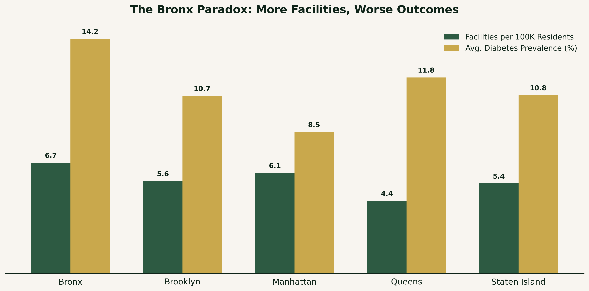
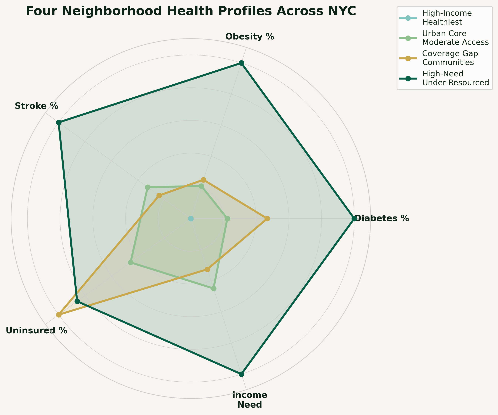
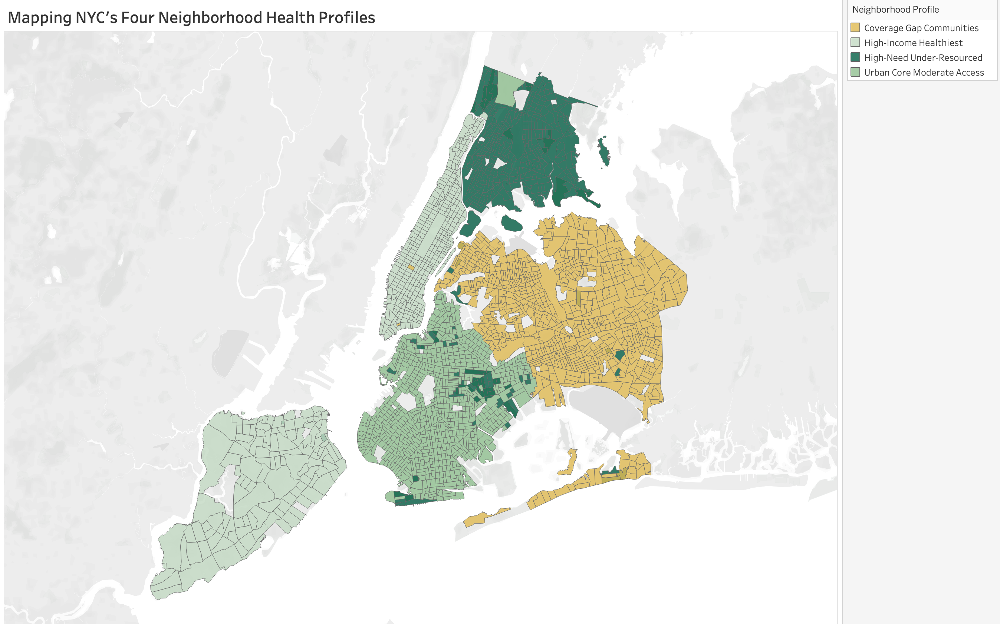

# NYC Healthcare Access Equity Analysis

**More hospitals don't mean healthier neighborhoods. The Bronx has more healthcare facilities per capita than any NYC borough, and the worst health outcomes. This analysis of 2,368 census tracts reveals why income, not access, drives health disparities and where healthcare investment is needed most.**

[](https://public.tableau.com/app/profile/jess.duong/viz/NYCHealthcareAccessEquityAnalysis/NYCHealthcareAccessEquityAnalysis)
[](reports/)
[](scripts/)
[](visualizations/)

---

## Project Background

NYC invests billions in healthcare infrastructure, yet health outcomes vary dramatically by neighborhood. The conventional assumption is that expanding facility access will improve outcomes, but this analysis proves otherwise. Across 2,368 census tracts and five boroughs (2018-2022), the Bronx has the highest facility rate per capita (6.7 per 100K) and the worst diabetes prevalence (14.2%), while Manhattan has fewer facilities but the best outcomes (8.5% diabetes). Income, not access, is the primary driver.

By merging CDC health data, Census demographics, and NYC Open Data facility records, then applying linear regression and K-means clustering, this analysis identified four distinct neighborhood health profiles. The most vulnerable communities, with $53K median income, 14.8% diabetes, and 34.3% obesity, are concentrated in the South Bronx and Central Brooklyn. The recommendation to NYC Department of Health leadership: stop building more clinics and start investing in barrier reduction, insurance navigation, and integrated economic support in the neighborhoods that need it most.

---

## Data Structure

Three datasets were merged into a master analytical file, plus one independent time series:

**Datasets merged:** CDC PLACES health outcomes (10,699 tract-year observations) | U.S. Census ACS demographics (borough-level income and population) | NYC Open Data healthcare facilities (aggregated to borough level)

**Independent dataset:** FRED NYC unemployment rate (NEWY636URN), monthly, Jan 2000 - Dec 2024, 300 observations

**Master dataset:** 10,699 rows | 2,368 unique census tracts | 5 boroughs | 5 years (2018-2022) | 14 variables

**Analytical methods applied:** Linear regression (income vs. diabetes prevalence) | K-means clustering (k=4, 9 standardized variables, n=8,582) | Time series decomposition and stationarity testing | Geospatial choropleth mapping

The CDC PLACES dataset required loading and filtering 5 years of census tract files across NYC's five counties. Each file was filtered to NYC FIPS codes and four key health measures before being combined into a single analytical dataset:

```python
# Define NYC county FIPS codes and key health measures to extract
nyc_fips = [36005, 36047, 36061, 36081, 36085]
key_measures = ['Diabetes', 'Obesity', 'Depression', 'Stroke']

all_years = []

files = {
    'PLACES_2020_census_tract.csv': 'PLACES 2020',
    'PLACES_2021_census_tract.csv': 'PLACES 2021',
    'PLACES_2022_census_tract.csv': 'PLACES 2022',
    'PLACES_2023_census_tract.csv': 'PLACES 2023',
    'PLACES_2024_census_tract.csv': 'PLACES 2024'
}

for filename, label in files.items():
    filepath = f'data/Original Data/{filename}'
    df = pd.read_csv(filepath)

    # Filter to NYC counties and key health measures only
    df_nyc = df[(df['CountyFIPS'].isin(nyc_fips)) & (df['Short_Question_Text'].isin(key_measures))]
    all_years.append(df_nyc)
    print(f"{label}: {len(df_nyc)} rows, Years: {df_nyc['Year'].unique()}")

# Combine all years into a single analytical dataset
places_all = pd.concat(all_years, ignore_index=True)
print(f"\nTotal combined rows: {len(places_all)}")
print(f"Years covered: {sorted(places_all['Year'].unique())}")
print(f"Unique census tracts: {places_all['LocationName'].nunique()}")
```

---

## Executive Summary

**The central finding is counterintuitive: income, not facility access, is the primary driver of health outcomes in NYC.** The Bronx has the highest healthcare facility rate per capita yet the worst health outcomes across every metric. Meanwhile, K-means clustering revealed four distinct neighborhood profiles, with the most vulnerable communities concentrated in the South Bronx and Central Brooklyn. Economic shocks like COVID-19 disproportionately impact these same neighborhoods.

### Top Findings

**1. Income drives health outcomes, not facility access (The Bronx Paradox).** The Bronx has the highest facility rate per capita (6.7 per 100K) yet the worst diabetes rate (14.2%). Manhattan has fewer facilities per capita but the best health outcomes (8.5% diabetes). Regression confirms income significantly predicts diabetes (p < 0.0001), with an R-squared of 0.16 due to the granularity mismatch between borough-level income and tract-level health data.

**2. Four distinct neighborhood health profiles exist across NYC.** K-means clustering identified four community types ranging from High-Income Healthiest (Cluster 0: $102K income, 9.0% diabetes) to High-Need Under-Resourced (Cluster 3: $53K income, 14.8% diabetes, 34.3% obesity). Health outcomes worsen consistently as income decreases.

**3. Health disparities are geographically concentrated.** Cluster 3 (worst outcomes) concentrates in the South Bronx and parts of Brooklyn. Cluster 0 (best outcomes) dominates Manhattan and Staten Island. Queens has the lowest facility density and highest uninsured rate (7.4%), representing a distinct coverage gap.

**4. Economic shocks disproportionately impact vulnerable communities.** NYC unemployment hit 17.6% during COVID (May 2020), exceeding the national peak. Recovery is slowest in the same Cluster 3 neighborhoods that already have the worst health outcomes and fewest economic resources.

---

## Insights Deep Dive

### The Bronx Paradox



The Bronx has more healthcare facilities per 100K residents than any other borough (6.7), yet it also has the highest diabetes prevalence (14.2%), the highest obesity rate (33.2%), and the highest stroke rate (3.8%). Manhattan, with a moderate facility rate (6.1 per 100K), has the lowest diabetes rate at 8.5%. This pattern holds across every health metric measured; more facilities do not equal better outcomes. Income is the real driver, with the Bronx's $48.7K median income compared to Manhattan's $103.9K explaining the disparity far more than facility access.

To confirm that income and not access was the true predictor of health outcomes, a linear regression model was built with median income as the independent variable and diabetes prevalence as the dependent variable, using a 70/30 train/test split:

```python
# Define independent variable (X) and dependent variable (y)
# Reshape into NumPy arrays as required by scikit-learn
X = master['median_income'].values.reshape(-1, 1)  # Independent variable (must be 2D array)
y = master['diabetes_pct'].values                  # Dependent variable (1D array)

# Split data into training (70%) and test (30%) sets
X_train, X_test, y_train, y_test = train_test_split(X, y, test_size=0.3, random_state=42)

# Create and fit the regression model to the training dataset
regression = LinearRegression()
regression.fit(X_train, y_train)

# Use the model to predict diabetes prevalence on the test set
y_predicted = regression.predict(X_test)
```

The model confirmed income as a statistically significant predictor (p < 0.0001). The R² of 0.16 reflects the granularity mismatch between borough-level income and tract-level health data, not a weak underlying relationship.

---

### Four Neighborhood Health Profiles



K-means clustering (k=4) identified four distinct neighborhood profiles across NYC. The radar chart normalizes all five dimensions to a 0-1 scale, with income inverted so higher values represent greater need. Cluster 3 (High-Need, Under-Resourced) dominates across every dimension. These neighborhoods have the lowest income ($53K), highest diabetes (14.8%), highest obesity (34.3%), and highest stroke rates (4.1%). The clear expansion from inner to outer profiles reinforces that health disparities follow a consistent income gradient.

The optimal number of clusters was determined using the elbow method, then k-means was fitted to the standardized data and cluster labels were attached back to the original dataset:

```python
# Use the elbow technique to determine the optimal number of clusters
# Test a range of 1 to 10 clusters
kmeans_list = [KMeans(n_clusters=i, random_state=42, n_init=10) for i in range(1, 11)]

# Calculate inertia (within-cluster sum of squares) for each cluster count
scores = [kmeans_list[i].fit(df_scaled).inertia_ for i in range(len(kmeans_list))]

# Plot the elbow curve to visually identify the optimal k
pl.plot(range(1, 11), scores, marker='o')
pl.xlabel('Number of Clusters')
pl.ylabel('Inertia (Within-Cluster Sum of Squares)')
pl.title('Elbow Technique: Optimal Number of Clusters')
plt.savefig('visualizations/elbow_chart.png', dpi=150, bbox_inches='tight')
plt.show()

# Run k-means with the optimal k=4 identified from the elbow curve
kmeans = KMeans(n_clusters=4, random_state=42, n_init=10)
kmeans.fit(df_scaled)

# Attach cluster labels back to the original (non-scaled) dataframe
df_cluster_results = df_cluster.reset_index(drop=True)
df_cluster_results['cluster'] = kmeans.labels_

# Check how many observations fall into each cluster
print(df_cluster_results['cluster'].value_counts().sort_index())
```

| Profile | Tracts | Avg. Income | Diabetes | Obesity | Uninsured |
|---------|--------|-------------|----------|---------|-----------|
| High-Income Healthiest | 1,583 | $102,357 | 9.0% | 23.1% | 4.1% |
| Urban Core Moderate Access | 2,897 | $80,023 | 10.3% | 25.5% | 5.6% |
| Coverage Gap Communities | 2,598 | $86,150 | 11.7% | 25.9% | 7.4% |
| High-Need Under-Resourced | 1,504 | $52,657 | 14.8% | 34.3% | 6.9% |

---

### Geographic Concentration



The most vulnerable communities are geographically concentrated. Cluster 3 (darkest green) fills the South Bronx and extends into parts of Central Brooklyn. Cluster 0 (lightest green) dominates Manhattan and Staten Island. Queens is predominantly Cluster 2 (gold), representing a distinct coverage gap — it has the highest uninsured rate (7.4%) and the lowest facility density (4.4 per 100K). This geographic concentration means targeted interventions can reach the most vulnerable populations efficiently.

---

## Recommendations

**Target Investment in Cluster 3 Neighborhoods.** Prioritize South Bronx and Central Brooklyn where $53K median income coincides with 14.8% diabetes prevalence. These neighborhoods need integrated health and economic support, not just more clinics.

**Shift Resources from Facility Expansion to Barrier Reduction.** The Bronx Paradox shows more facilities alone do not improve outcomes. Redirect investment toward transportation access, health literacy programs, and preventive care outreach that address the real barriers.

**Expand Insurance Navigation in Queens.** Queens has the highest uninsured rate (7.4%) and lowest facility density. Insurance enrollment services and community health workers could close this specific coverage gap.

**Build Proactive Surge Capacity for Economic Downturns.** NYC unemployment hit 17.6% during COVID. Cluster 3 communities have the fewest resources to absorb economic shocks. Healthcare planning must account for economic volatility with flexible staffing and emergency funding mechanisms.

---

## Tools & Skills

| Tool | Use |
|------|-----|
| Python (pandas, scikit-learn, statsmodels) | Data cleaning, merging, regression, K-means clustering |
| Tableau Desktop & Public | Interactive dashboard with 5 story points, choropleth maps, calculated fields |
| matplotlib, seaborn, Folium | Static visualizations, correlation heatmaps, interactive choropleth maps |
| Jupyter Notebook | Analysis pipeline across 6 notebooks |
| Excel | 10-sheet companion report with full documentation |

**Python techniques demonstrated:** Multi-file data loading with loop and filter · Multi-source dataset merging (CDC, Census, NYC Open Data) · Linear regression with train/test split · K-means clustering with elbow optimization · Geospatial choropleth mapping · Per-capita rate calculation (Tableau calculated field)

---

## Deliverables

| Document | Description |
|----------|-------------|
| [Tableau Dashboard](https://public.tableau.com/app/profile/jess.duong/viz/NYCHealthcareAccessEquityAnalysis/NYCHealthcareAccessEquityAnalysis) | Interactive 5-story-point storyboard with maps, scatterplots, cluster analysis, and recommendations |
| [Final Analysis Report](reports/) | 10-sheet Excel workbook documenting data integration, cleaning, all analytical results, and recommendations |
| [Python Notebooks](scripts/) | 6 Jupyter notebooks covering the full analysis pipeline from data prep through time series |
| [Visualizations](visualizations/) | Choropleth maps, correlation heatmaps, cluster scatterplots, regression plots, time series charts |

---

## Author

**Jessica Duong**

Data Analyst | [LinkedIn](https://www.linkedin.com/in/jess-duong/) | [Portfolio](https://jess-duong.github.io/) | duong.t.jess@gmail.com

---

*Data sources: CDC PLACES (2020-2024 releases), U.S. Census American Community Survey, NYC Open Data Health Facility dataset, FRED NYC Unemployment Rate (NEWY636URN).*

## Acknowledgments

AI tools were used to support portions of this project, including project planning, dataset evaluation, and documentation. All analysis, code execution, interpretation, and recommendations are my own.
